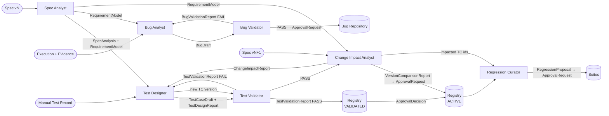
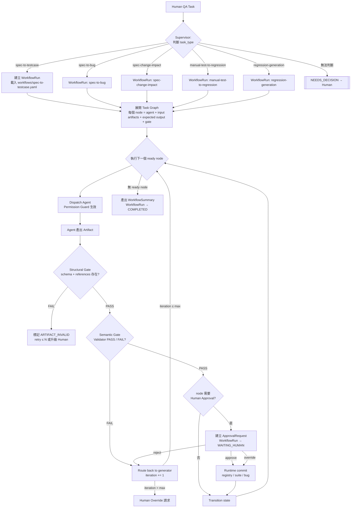

# 01 — System Architecture

> Phase 1 產出。狀態：APPROVED（ADR-004）。

## 1. 架構總覽

QAOS 不是 Prompt Library，而是一個 **以 Artifact 為中心的狀態機系統**。系統由五層組成：

| 層 | 內容 | 決策性質 |
|---|---|---|
| **L0 Human Layer** | QA 工程師發起 Task、回答 `[NEEDS_DECISION]`、做 approve / reject / override | 最終業務決策 |
| **L1 Orchestration Layer** | Supervisor（LLM 判斷 + deterministic runtime） | Task 分類、Workflow Run 建立、Routing、Gate 觸發 |
| **L2 Agent Layer** | 8 個 Role Agent（見 §3） | 在 Allowed Actions 邊界內產生 Artifact |
| **L3 Skill Layer** | 可重用方法論（test-design、traceability、change-impact…） | 無決策權，純能力 |
| **L4 Storage Layer** | Registry / Suite / Bug / Artifact / Execution / Evidence / Approval / Run，皆為版本化檔案 | 唯一事實來源 |

貫穿五層的橫切關注點：**Schema Validation、State Machine、Quality Gate、Permission Boundary、Audit Trail**。

### 核心不變式（Invariants）

1. **No Artifact, No Transition** — Workflow 狀態只能由「通過 Schema 驗證的 Artifact」推進。
2. **No Validation, No Registry** — 只有 `VALIDATED` 以上的 Test Case 才能存在於 Registry。
3. **No Approval, No Production Change** — Registry 的 ACTIVE 版本、Suite Membership、Bug 的 OPEN 以後狀態，只能由 Human ApprovalDecision 觸發。
4. **No Evidence, No Formal Bug** — Bug 進入 `VALIDATED` 前必須至少有一筆 Evidence 支撐 `actual_result`。
5. **No Traceability, No Accepted Test Case** — Test Case 必須有 ≥1 `requirement_id` 且 `spec_id + spec_version` 存在。
6. **Suite references, never copies** — Suite 只存 `testcase_id + version pin`。
7. **Version everything** — Spec / Requirement / TestCase / Suite / Artifact 都有 version，舊版永不刪除。
8. **Explicit permissions** — Agent 只能呼叫 Action Registry 中被授權的 Action；Runtime 拒絕其他呼叫並記錄。
9. **Human owns business decisions** — Agent 只有 propose / draft / analyze / validate / compare / recommend。
10. **Correctness & auditability before autonomy** — Phase 1–4 全部同步、單 Agent 逐步執行，沒有自主規劃。

## 2. 系統架構圖（Mermaid #1）

```mermaid
flowchart TB
    subgraph L0["L0 · Human Layer"]
        H[QA Engineer]
    end

    subgraph L1["L1 · Orchestration Layer"]
        SUP[QA Supervisor Agent<br/>Task 分類 · Routing · Summary]
        RT[Deterministic Runtime<br/>Schema Validator · State Machine · Gate Evaluator · Permission Guard · Audit Log]
        SUP <--> RT
    end

    subgraph L2["L2 · Agent Layer"]
        SA[Spec Analyst]
        TD[Test Designer<br/>modes: spec / change / manual]
        TV[Test Validator]
        BA[Bug Analyst]
        BV[Bug Validator]
        CIA[Change Impact Analyst]
        RC[Regression Curator]
    end

    subgraph L3["L3 · Skill Layer"]
        SK1[spec-analysis]
        SK2[test-case-design]
        SK3[test-validation]
        SK4[bug-analysis / bug-report]
        SK5[change-impact-analysis]
        SK6[regression-management]
        SK7[traceability · schema-tools]
    end

    subgraph L4["L4 · Storage Layer (versioned files)"]
        SPEC[(specs/)]
        REQ[(artifacts/requirements/)]
        REG[(testcases/registry + versions)]
        SUITE[(testsuites/)]
        BUG[(bugs/)]
        ART[(artifacts/)]
        EXE[(executions/ · evidence/)]
        APR[(approvals/)]
        RUN[(runs/)]
    end

    H -->|QA Task| SUP
    SUP -->|dispatch + input artifact| SA & TD & TV & BA & BV & CIA & RC
    SA & TD & TV & BA & BV & CIA & RC -->|output artifact| RT
    RT -->|Gate PASS → next agent / FAIL → route back| SUP
    RT -->|ApprovalRequest| H
    H -->|ApprovalDecision| RT
    RT -->|commit only after approval| REG & SUITE & BUG
    RT --> ART & APR & RUN
    SA -.uses.-> SK1 & SK7
    TD -.uses.-> SK2 & SK7
    TV -.uses.-> SK3 & SK7
    BA & BV -.uses.-> SK4 & SK7
    CIA -.uses.-> SK5 & SK7
    RC -.uses.-> SK6 & SK7
    SA -.reads.-> SPEC
    TD & TV & CIA & RC -.reads.-> REQ & REG
    BA & BV -.reads.-> EXE & BUG
```

## 3. Agent 組成（Architecture Review 後的調整）

原始 Brief 列 9 個 Agent。Review 後建議 **8 個 Agent Role + 1 個 Deterministic Runtime**：

| # | Agent | 保留/調整 | 理由 |
|---|---|---|---|
| 1 | QA Supervisor | **拆分**：Supervisor Agent（LLM）+ Deterministic Runtime（非 LLM） | Gate 的結構檢查、State 轉換、Permission 檢查必須 deterministic，不能交給 LLM 「判斷」；LLM 只負責 Task 分類、Routing 建議、Summary。 |
| 2 | Spec Analyst | 保留 | — |
| 3 | Test Designer | 保留，增加 `mode` = `spec` / `change` / `manual` | Workflow A / C / D 的設計工作本質相同，差別只在輸入來源。 |
| 4 | Test Validator | 保留 | Generator/Validator 分離是核心防線。 |
| 5 | Bug Analyst | 保留 | — |
| 6 | Bug Validator | 保留 | Brief §7.6 明確要求不可由 Bug Analyst 自我批准。 |
| 7 | Change Impact Analyst | 保留，明確為兩階段（Impact → Compare） | Brief §7.7 與 §22 對「誰做 Compare」不一致，收斂到此 Agent。 |
| 8 | Regression Curator | 保留 | — |
| 9 | Manual Test Integrator | **合併** 為 Test Designer `mode=manual` | 其職責是「正規化人工測試紀錄 → Test Case Draft + 對映 Requirement」，沒有獨立的決策邊界；獨立 Agent 只會增加 Contract 維護成本。**列為 [NEEDS_DECISION-03]**，若你希望保留獨立 Agent，Contract 已可直接拆出。 |

## 4. Agent 依賴圖（Mermaid #2）

**依賴規則**：箭頭只能是 Artifact；任何 Agent 不得讀取另一 Agent 的對話紀錄。

## 5. Supervisor 任務圖（Mermaid #11）

## 6. 執行時期模型（Runtime Model）

### 6.1 兩層 Gate

| 層 | 執行者 | 內容 | 結果 |
|---|---|---|---|
| **Structural Gate** | Deterministic Runtime | JSON Schema 驗證、`references` 中的 ID 是否存在、version 是否存在、必要欄位是否非空、Agent 是否越權 | `ARTIFACT_VALID` / `ARTIFACT_INVALID` |
| **Semantic Gate** | Validator Agent（或 Human） | 語意正確性（符合 SPEC、無未定義假設、Evidence 支撐 actual result…） | `PASS` / `FAIL` + Report |

Structural Gate 永遠先於 Semantic Gate；Structural FAIL 不消耗 Semantic 迭代次數，但**同一 task 連續 3 次 Structural FAIL 會升級為 `NEEDS_DECISION`**（retry / cancel）。Gate 規則修正後可對既有 VALID artifact 直接重評（task READY → RUNNING），不必重產 artifact。

### 6.2 Generator → Validator 迴圈

- 每個 Workflow 定義 `max_validation_iterations`（建議預設 **3**，[NEEDS_DECISION-06]）。
- 超過上限 → `ApprovalRequest(type=HUMAN_OVERRIDE)`，WorkflowRun 進入 `WAITING_HUMAN`。
- Validator 的 Report 必須是 Designer 的正式 Input（Artifact 傳遞，不靠對話記憶）。

### 6.3 Commit 語意

Agent **永遠不寫** `testcases/registry/`、`testsuites/`、`bugs/` 的正式狀態。只有 Runtime 在收到 `ApprovalDecision(decision=approve|override)` 後執行 `COMMIT_TO_REGISTRY` / `UPDATE_SUITE_MEMBERSHIP` / `COMMIT_BUG`。這些 Action 屬於 **system-only**，不在任何 Agent 的 `allowed_actions`。

### 6.4 執行環境（Claude Code Native）

Phase 2–4 的建議實作方式（[NEEDS_DECISION-01]）：

| 元件 | Claude Code 對應 |
|---|---|
| Supervisor Agent | 主 session + `skills/qaos-supervisor`（或 `/qaos` slash command） |
| Role Agents | `.claude/agents/<agent>.md`（subagent，`tools:` 限縮為只讀 + 寫入自身 artifact 目錄） |
| Skills | `.claude/skills/<skill>/SKILL.md` |
| Deterministic Runtime | `tools/qaos` CLI（Python）：`validate`、`transition`、`gate`、`commit`、`approve`；由 Hooks 於 subagent 完成後自動執行 Structural Gate |
| Permission Guard | subagent `tools:` allowlist + `PreToolUse` hook 檢查寫入路徑 |
| Storage | 純檔案（YAML 為 source of truth、JSON Schema 驗證、git 為 audit trail） |

## 7. 與 Brief 的差異總表

| Brief 條文 | 調整 | 詳見 |
|---|---|---|
| §3 九個 Agent | 8 Agent + Runtime；Manual Test Integrator 併入 Test Designer | 本文 §3、決策 03 |
| §6 Action Registry | 新增 READ_BUG / READ_ARTIFACT / READ_APPROVAL、Orchestration Actions、System-only Actions；EXECUTE_TEST 標記 reserved | `05-permission-matrix.md` |
| §8 Test Level 含 Manual | 移除；改用 `execution_mode` | `02-data-model.md`、決策 04 |
| §8 Test Type 含 Regression/Smoke/Hotfix | 移除；由 Suite Membership 表達 | `02-data-model.md`、決策 05 |
| §11 `regression_status`/`ci_status` | 改為 derived（由 Suite 反查），TC 本體只存 eligibility | `02-data-model.md` |
| §20 Workflow A 無 Human Approval | 加入「VALIDATED 進 Registry、ACTIVE 需 Approval」 | 決策 02 |
| §24 Regression Generation 無 Human Approval | 所有 Suite Membership 變更一律 Approval | `workflows/regression-generation.yaml` |
| §25 Test Design Gate 與 Validation Gate 重疊 | Test Design Gate 降為 Designer self-check（Structural + checklist），正式判定在 Validation Gate | `04-quality-gates.md` |
