# 02 — Data Model

> 所有 Entity 的 Schema 在 `schemas/` 以 JSON Schema (draft 2020-12) 定義；本文說明語意、版本策略與關聯。儲存格式：**YAML 為 source of truth**（人可審、可加註解），JSON Schema 驗證，git 為 audit trail。

## 1. Entity 總覽

| Entity | ID 格式 | 版本化 | 生命週期 | 儲存位置 |
|---|---|---|---|---|
| Spec | `SPEC-<AREA>-<seq>` | `spec_version`（semver `1.0`、`1.1`） | IMPORTED → ANALYZED → SUPERSEDED | `specs/<product>/<area>/<spec_id>/v<ver>.md` + `spec.yaml` |
| Requirement | `REQ-<AREA>-<seq>` | 綁定 `spec_id@spec_version`；內容變更 → 新 `version` | DRAFT → ACTIVE → CHANGED → RETIRED | `artifacts/requirements/<spec_id>/v<ver>/requirements.yaml` |
| AcceptanceCriterion | `AC-<AREA>-<REQ 序號><AC 序號>`（從所屬 REQ 推導，見 §5） | 隨 Requirement | 同 Requirement | 內嵌於 Requirement |
| TestCase | `TC-<AREA>-<seq>` | `version` 整數 (v1, v2…) | 見 `03-state-machines.md` | `testcases/versions/<tc_id>/v<n>.yaml`；`testcases/registry/<tc_id>.yaml` 為 pointer |
| TestSuite | `SUITE-<TYPE>[-<AREA>]` | `version` 整數；每次 membership 變更 +1 | DRAFT → PENDING_APPROVAL → ACTIVE → RETIRED | `testsuites/<type>/<suite_id>.yaml` |
| SuiteMembership | 內嵌於 TestSuite | 隨 Suite | — | 內嵌 |
| TestExecution | `EXE-<yyyymmdd>-<seq>` | 不可變 | RECORDED | `executions/<yyyy-mm>/<exe_id>.yaml` |
| Evidence | `EVD-<seq>` | 不可變（含 hash） | RECORDED | `evidence/<exe_id or bug_id>/<evd_id>.yaml` + 檔案 |
| Bug | `BUG-<AREA>-<seq>` | `version` 整數 | 見 `03-state-machines.md` | `bugs/<product>/<area>/<bug_id>.yaml` |
| ChangeImpact | `CI-<spec_id>-<from>-<to>` | 不可變 | 見 `03-state-machines.md` | `artifacts/change-impact/` |
| Artifact (11 種) | `ART-<TYPE>-<ulid>` | `version` 整數 | DRAFT → SUBMITTED → VALID → INVALID → SUPERSEDED | `artifacts/<type-dir>/<run_id>/` |
| WorkflowRun | `RUN-<yyyymmdd>-<seq>` | — | 見 `03-state-machines.md` | `runs/<run_id>/run.yaml` + `tasks/` + `audit.log` |
| ApprovalRequest | `APR-<seq>` | — | PENDING → DECIDED → EXPIRED | `approvals/<apr_id>.yaml` |
| ApprovalDecision | 內嵌於 ApprovalRequest | 不可變 | — | 內嵌 |
| Clarification（問 PM 的單） | `CLR-<AREA>-<seq>` | 不可變（回答附加） | OPEN → ASKED → ANSWERED → APPLIED \| WITHDRAWN | `clarifications/<product>/<area>/<clr_id>.yaml` + 同名 `.md`（給 PM 看） |
| AgentContract | `agent-<slug>` | semver | — | `agents/<slug>.yaml` |
| Action | `SCREAMING_SNAKE` | — | — | `permissions/action-registry.yaml` |

> `<AREA>` = functional area code（`AUTH`、`PAY`…），在 `specs/<product>/areas.yaml` 登記。多 product 時 ID 是否加 product 前綴：[NEEDS_DECISION-07]。

## 2. ERD（Mermaid #8）

```mermaid
erDiagram
    SPEC ||--|{ SPEC_VERSION : has
    SPEC_VERSION ||--|{ REQUIREMENT : derives
    REQUIREMENT ||--|{ ACCEPTANCE_CRITERION : contains
    REQUIREMENT }|--|{ TESTCASE_VERSION : "traced by"
    ACCEPTANCE_CRITERION }o--o{ TESTCASE_VERSION : "covered by"
    TESTCASE ||--|{ TESTCASE_VERSION : has
    TESTCASE ||--o| TESTCASE_VERSION : "active_version"
    TEST_SUITE ||--|{ SUITE_MEMBERSHIP : contains
    SUITE_MEMBERSHIP }o--|| TESTCASE : references
    TESTCASE_VERSION ||--o{ TEST_EXECUTION : "executed as"
    TEST_EXECUTION ||--o{ EVIDENCE : produces
    BUG }o--|| REQUIREMENT : violates
    BUG }o--|| SPEC_VERSION : "against"
    BUG }o--o| TESTCASE_VERSION : "found by"
    BUG }o--o| TEST_EXECUTION : "observed in"
    BUG ||--|{ EVIDENCE : "supported by"
    SPEC_VERSION ||--o{ CHANGE_IMPACT : "from"
    CHANGE_IMPACT }o--|{ REQUIREMENT : "affects"
    CHANGE_IMPACT }o--o{ TESTCASE : "impacts"
    WORKFLOW_RUN ||--|{ TASK : contains
    TASK ||--o{ ARTIFACT : produces
    TASK }o--|| AGENT_CONTRACT : "executed by"
    ARTIFACT }o--o{ ARTIFACT : references
    ARTIFACT ||--o| APPROVAL_REQUEST : "raises"
    APPROVAL_REQUEST ||--o| APPROVAL_DECISION : "decided by human"
    APPROVAL_DECISION ||--o{ TESTCASE_VERSION : activates
    APPROVAL_DECISION ||--o{ SUITE_MEMBERSHIP : commits
    APPROVAL_DECISION ||--o{ BUG : opens
    AGENT_CONTRACT }|--|{ ACTION : "allowed"

    SPEC {
        string spec_id PK
        string product
        string functional_area
        string title
    }
    SPEC_VERSION {
        string spec_id FK
        string spec_version PK
        string source_uri
        string content_hash
        date effective_at
    }
    REQUIREMENT {
        string requirement_id PK
        int version
        string spec_id FK
        string spec_version FK
        string type
        string statement
        string status
    }
    ACCEPTANCE_CRITERION {
        string ac_id PK
        string requirement_id FK
        string given
        string when
        string then
    }
    TESTCASE {
        string testcase_id PK
        int active_version
        string status
        string product
        string functional_area
    }
    TESTCASE_VERSION {
        string testcase_id FK
        int version PK
        string status
        string test_level
        string[] test_types
        string priority
        string risk
        string[] requirement_ids
        string spec_version
        string execution_mode
        bool ci_eligible
        bool hotfix_eligible
    }
    TEST_SUITE {
        string suite_id PK
        string suite_type
        int version
        string status
    }
    SUITE_MEMBERSHIP {
        string testcase_id FK
        int pinned_version
        string justification
        string added_by_approval FK
    }
    TEST_EXECUTION {
        string execution_id PK
        string testcase_id FK
        int testcase_version
        string result
        string executor
        string environment
        datetime executed_at
    }
    EVIDENCE {
        string evidence_id PK
        string type
        string uri
        string sha256
        datetime captured_at
    }
    BUG {
        string bug_id PK
        int version
        string status
        string severity
        string priority
        string requirement_id FK
        string spec_version FK
    }
    CHANGE_IMPACT {
        string change_impact_id PK
        string spec_id FK
        string from_version
        string to_version
        string status
    }
    WORKFLOW_RUN {
        string run_id PK
        string workflow_id
        string status
        string initiated_by
    }
    TASK {
        string task_id PK
        string run_id FK
        string agent_id FK
        string status
        int iteration
    }
    ARTIFACT {
        string artifact_id PK
        string artifact_type
        int version
        string status
        string created_by
        string run_id FK
    }
    APPROVAL_REQUEST {
        string approval_id PK
        string type
        string artifact_id FK
        string status
    }
    APPROVAL_DECISION {
        string approval_id FK
        string decision
        string decided_by
        datetime decided_at
        string rationale
    }
    AGENT_CONTRACT {
        string agent_id PK
        string version
    }
    ACTION {
        string action_id PK
        string category
        string phase
    }
```



## 3. 核心 Entity 說明

### 3.1 Spec / SpecVersion
- Spec 是「文件身份」，SpecVersion 是「不可變內容快照」。
- `content_hash` 用來偵測「同版本號但內容變了」的異常。
- Agent 對 Spec 只有讀權限；任何 Spec 修改由 Human 匯入新版本。
- 來源格式：Markdown 為主；Confluence / Jira 匯入方式屬 [NEEDS_DECISION-08]。

### 3.2 Requirement / AcceptanceCriterion
- 由 Spec Analyst 從 SpecVersion 導出，是 **RequirementModel artifact 的持久化結果**。
- `type`: `functional | constraint | non_functional | security | edge_case_candidate`
- `ambiguity`: 若 Spec 語意不明，Requirement 標記 `ambiguity: {level, description, options}`，且狀態不得為 ACTIVE 直到 Human 決定。
- AC 採 Given / When / Then。

### 3.3 TestCase / TestCaseVersion
Brief §11 欄位對應調整：

| Brief 欄位 | 決策 |
|---|---|
| `test_level` | enum `unit \| component \| integration \| api \| ui_e2e`（移除 `manual`，改 `execution_mode: manual \| automated \| hybrid`）[NEEDS_DECISION-04] |
| `test_type` | 陣列，enum `functional \| negative \| boundary \| security \| performance \| usability \| compatibility`（移除 `regression \| smoke \| hotfix`，改由 Suite Membership 表達）[NEEDS_DECISION-05] |
| `regression_status` / `ci_status` | **不存於 TC**；由 `tools/qaos suites-of <tc_id>` 反查。避免雙寫不一致。 |
| `hotfix_eligibility` | 保留為 `hotfix_eligible: bool` + `ci_eligible: bool`（TC 屬性，非 membership） |
| 新增 | `execution_cost: low\|medium\|high`、`stability: unknown\|stable\|flaky`、`design_technique[]`（BVA/EP/DT/ST/…，供 Validator 檢核方法論覆蓋）、`acceptance_criteria_ids[]`、`supersedes: version` |
| `source` | enum `spec_workflow \| change_workflow \| manual_integration \| import` |
| `created_by` / `validated_by` / `approved_by` | 分別為 agent_id / agent_id / human identifier；`approved_by` 必須指向 `approval_id` |

Registry pointer 檔（`testcases/registry/<tc_id>.yaml`）只存：`testcase_id, active_version, status, versions: [ {version, status, superseded_by} ]`。

### 3.4 TestSuite / SuiteMembership
- `suite_type`: `full_regression | ci_regression | hotfix | smoke | feature`
- Membership 欄位：`testcase_id, pinned_version ("active" 或整數), justification, risk_tag, added_by_approval`。
- `pinned_version: "active"` 表示永遠跟隨 Registry 的 active version；Hotfix Suite 建議 pin 整數版本以確保可重現。

### 3.5 TestExecution / Evidence
- Execution 在 Phase 1–4 由 **Human 或 CI 匯入**，不由 Agent 執行（`EXECUTE_TEST` reserved 至 Phase 5）。
- `result`: `pass | fail | blocked | skipped`
- Evidence `type`: `screenshot | recording | api_request | api_response | log | console | db_observation | execution_result | other`；必須有 `sha256`，Bug Validator 以此確認證據未被替換。

### 3.6 Bug
Brief §13 欄位全部保留，另新增：`evidence_ids[]`（必填 ≥1 才可 VALIDATED）、`execution_id`、`duplicate_of`、`ambiguity_suspected: bool`、`approval_id`。

### 3.7 ChangeImpact
```yaml
change_impact_id, spec_id, from_version, to_version,
requirement_diff: [{requirement_id, change: unchanged|changed|added|removed, detail}],
testcase_impact:  [{testcase_id, active_version, impact: unaffected|affected|obsolete|new_required, reason, affected_requirement_ids}],
status
```

### 3.8 Clarification（需求釐清單）
- 用途：需求不清楚、要問 PM 的單子。**兩個來源**：(a) Runtime 在 Spec Analyst 標記 `critical` ambiguity、建立 `RESOLVE_AMBIGUITY` approval 時，為每個未解的 ambiguity 自動開一張；(b) Human 用 `qaos clarification new` 手動開。
- 欄位：`question`、`context`、`options[]`（可能的解讀）、`impact_if_unanswered`、`asked_to`、`answer`、`answered_by`（PM）、`resolution`（`spec_updated` 會出新版 Spec / `requirement_clarified` 直接選定解讀 / `no_change` / `out_of_scope`）。
- 與 Approval 的關係：`RESOLVE_AMBIGUITY` approval 的 `impact[]` 指向對應 Clarification；Runtime 在 approve 前檢查其狀態必須是 `ANSWERED`，approve 後自動 `APPLIED`。**沒有 PM 回答，Human 也不能 approve** — 這是刻意的：避免 QA 自己替 PM 決定需求。
- 依 product / functional_area 分資料夾，`clarifications/index.md` 為總表。

### 3.9 Artifact Envelope（所有 11 種 Artifact 共用）
```yaml
artifact_id, artifact_type, schema_version, version,
run_id, task_id, created_by (agent_id), created_at, status,
source: {type, ids[]},          # 此 artifact 的輸入來源
references: [{entity_type, id, version}],  # 所有被引用的 entity；Structural Gate 逐一驗證存在
payload: {...}                  # 依 artifact_type 的 schema
```

11 種 `artifact_type` 與 payload schema：`SpecAnalysis, RequirementModel, TestDesignReport, TestCaseDraft, TestValidationReport, BugDraft, BugValidationReport, ChangeImpactReport, VersionComparisonReport(新增), RegressionProposal, ApprovalRequest, WorkflowSummary`。
> `VersionComparisonReport` 為新增：Brief §10 要求「比較報告」，但 §28 未列出對應 Artifact。

## 4. Traceability 鏈

```
SpecVersion ──> Requirement ──> AcceptanceCriterion
                    │                 │
                    └──> TestCaseVersion <──┘
                              │
                     ┌────────┴────────┐
                 SuiteMembership   TestExecution ──> Evidence
                                        │              │
                                        └──> Bug <─────┘
```

Runtime 提供 `qaos trace <id>` 由任一節點向上下游展開；Regression Gate 與 Validation Gate 都以此為準。

## 5. ID 與版本規則
- ID 一經配發永不重用；序號由 `registry/_counters.yaml` 管理，Runtime 配發，Agent 不得自行編號（Draft 階段使用 `TC-DRAFT-<ulid>` 暫時 ID，commit 時由 Runtime 換為正式 ID）。REQ 由主 session 以 `bin/qaos id` 配發後交給 Spec Analyst。
- AcceptanceCriterion 例外，不經計數器，從所屬 REQ 推導：`AC-<AREA>-<REQ 序號><AC 序號>`。
  - REQ 序號照抄所屬 REQ 的序號（目前固定 3 位數）；AC 序號從 1 開始、不補 0，第 10 個以後直接往上加（REQ-001 的第 10 個 AC 是 `AC-<AREA>-00110`）。REQ 序號固定 3 位數，拆解沒有歧義；REQ 序號達 1000 時，AC 格式需重新設計（G-SPEC 目前對序號超過 999 的 REQ 底下的新 AC 一律 FAIL）。
  - 不重編號：既有 AC 一律沿用原 ID；已用過的序號不得給新的驗收條件，同一條驗收條件恢復時沿用原 ID；中間插入的 AC 不把後面的往後推。新增 AC 取該 REQ 在所有 revision、所有 spec_version 用過的最大序號 + 1（Spec Analyst 的派發包以 `ac_seq_high_water` 提供這個值）。
  - MEMBER、BONUSCCY、ARCADE 既有的 3 位數 AC（如 `AC-MEMBER-025`，來自舊的 `AC-<AREA>` 計數器）照樣沿用、不遷移；這三區新增的 AC 改用推導格式，舊計數器不再使用。3 位數與 4 位數以上的字串不會撞號。
  - 一條 REQ 有 10 個以上 AC 時，視為需求可能太大的訊號：G-SPEC 不擋，structural PASS 時寫 audit（`GATE_ADVISORY`），並在 task 的 `gate_results` 加一筆 `layer: advisory`、`result: WARN` 的紀錄（排在同次 structural 結果之前）。
  - `bin/qaos id AC` 一律拒絕；G-SPEC 以 `gates.ac_id_issues()` 檢查上述規則（同一 spec 任一 revision 出現過、且掛在同一個 REQ 的 AC 可沿用，不論格式；新 AC 必須是推導格式、序號大於歷史最大值；同一份 model 內不得重複）。
- TestCase 新版本 = 新 `versions/<tc_id>/v<n>.yaml`；舊版狀態改 `SUPERSEDED`，檔案不刪。
- Spec 版本採 `major.minor`；Requirement 綁 SpecVersion；TC 綁 `spec_id@spec_version`。
