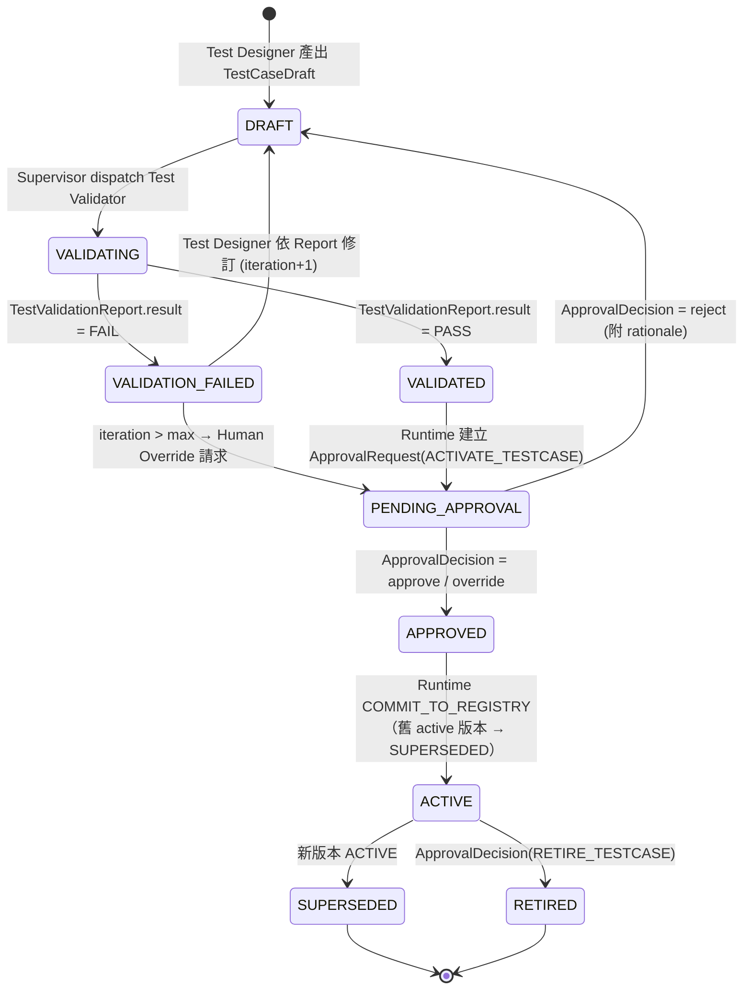
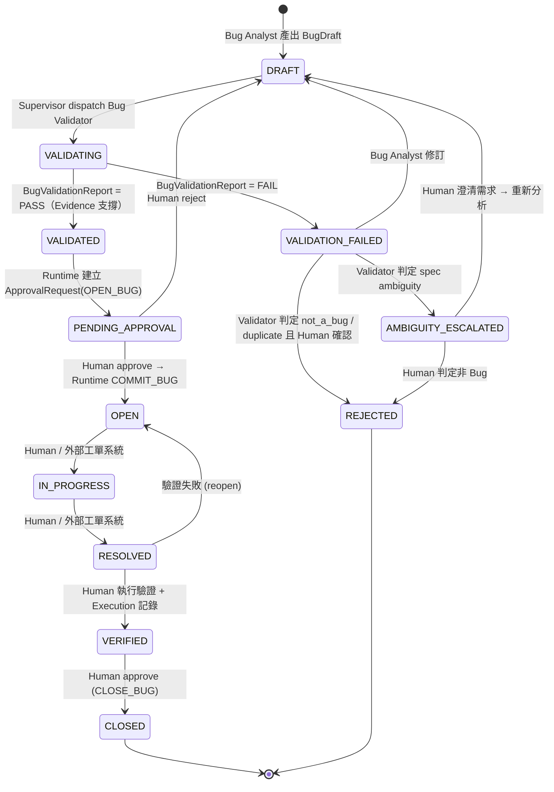
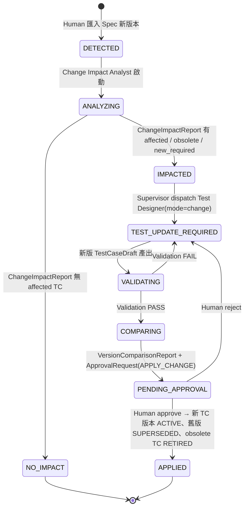
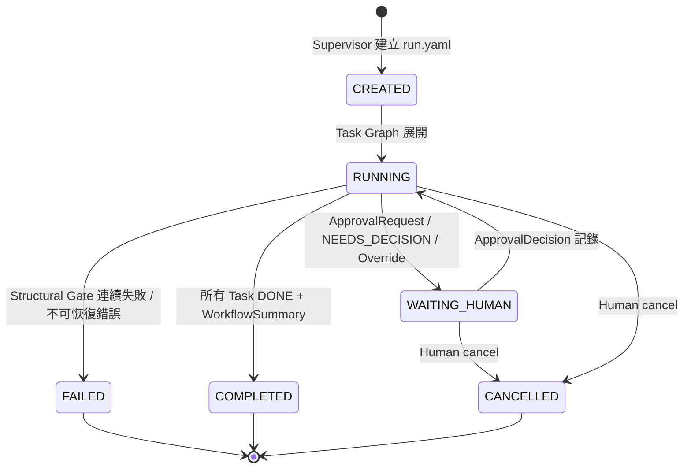

# 03 — State Machines

> 所有狀態轉換由 Deterministic Runtime 執行（`qaos transition`），每次轉換寫入 `runs/<run_id>/audit.log` 與 entity 的 `history[]`。**轉換的觸發者（agent / human / system）與所需 Artifact 必須符合下表，否則拒絕。**

## 1. Test Case（Mermaid #9）

| 轉換 | 觸發者 | 必要 Artifact / 條件 |
|---|---|---|
| `→ DRAFT` | Test Designer | `TestCaseDraft` 通過 Structural Gate |
| `DRAFT → VALIDATING` | Supervisor | — |
| `VALIDATING → VALIDATED / VALIDATION_FAILED` | Test Validator | `TestValidationReport` |
| `VALIDATED → PENDING_APPROVAL` | Runtime（自動） | `ApprovalRequest(type=ACTIVATE_TESTCASE)`；**VALIDATED 版本即寫入 `versions/`，但 Registry pointer 不變** |
| `PENDING_APPROVAL → APPROVED` | Human | `ApprovalDecision` |
| `APPROVED → ACTIVE` | Runtime | 執行 `COMMIT_TO_REGISTRY`，更新 pointer，舊版 → SUPERSEDED |

> [NEEDS_DECISION-02] 若你決定「VALIDATED 即可 ACTIVE（不需逐案 Human Approval）」，則 `VALIDATED → ACTIVE` 直接由 Runtime 執行；建議保留 Approval 但允許 **批次核准**（一個 ApprovalRequest 含多個 TC）。

## 2. Bug（Mermaid #10）

OPEN 之後的操作與 RD 外部修復流程見 `docs/workflows/bug-lifecycle.md`（`qaos bug resolve / verify / close`）。

新增狀態說明：`AMBIGUITY_ESCALATED`（Brief §7.6「是否可能只是需求 Ambiguity」需要一個可觀察的落點）、`REJECTED`（duplicate / not-a-bug 的終態）。`OPEN` 之後的狀態全部由 Human 驅動，Agent 只有讀權限。

## 3. Change Impact

## 4. Workflow Run

Task 狀態：`PENDING → READY → RUNNING → ARTIFACT_INVALID | GATE_FAILED | DONE | FAILED`；`ARTIFACT_INVALID` 與 `GATE_FAILED` 可回到 `READY`（受 `max_iterations` 限制）；`RUNNING → FAILED` 只在 permission violation 時發生，並使 Run 進入 FAILED。機器可讀定義：`workflows/state-machines.yaml`。

**同一 spec 同時只能有一個 run 在分析需求**（`engine.unlanded_analyses`）。需求分析 task 是 Spec Analyst、gate 為 G-SPEC 的 task（spec-to-testcase 的 T1，spec-change-impact、spec-to-bug 的 T0）。兩個 run 的分析都還沒落地時，後落地的一方會把先落地者的 REQ ID 當成沿用而通過 G-SPEC，造成同一個 ID 對應兩種語意，所以：

- `run new`：新 run 會執行需求分析（依 `_skip_decision`，與 Task Graph 展開時的判斷相同）時，同一 `spec_id`（不分版本）不得有「分析還沒落地」的進行中 run，也就是 run 不在終止狀態、分析 task 也不在終止狀態。
- `dispatch`：派發分析 task 時，同一 `spec_id` 不得有另一個 run 的分析在本 iteration 已派發、還沒落地。這涵蓋已落地的 run 被退回重開分析的情況：先派發的先落地，READY 但還沒派發的 run 不互相阻擋。
- 已落地（分析 task DONE）而在等人工的 run 不擋：它恢復時讀自己綁定的 revision（需求 A AC-09-2、09-3）。分析被略過的 run（DONE 且沒有產出）不擋，也不被擋。testcase-revision、manual-test-to-regression、regression-generation 沒有分析 task，不受影響。
- 不提供強制放行：被擋下時，等占用的 run 落地，或以 `bin/qaos run cancel <run_id>` 取消。

## 5. Artifact

`DRAFT → SUBMITTED → VALID | INVALID`；`VALID → SUPERSEDED`（同 task 產生新版本時）。只有 `VALID` 的 Artifact 可以作為下游 Agent 的 input。

## 6. Test Suite

`DRAFT → PENDING_APPROVAL → ACTIVE → RETIRED`。每次 Membership 變更都產生新 `version` 並經 `PENDING_APPROVAL`；ACTIVE 的 Suite 版本不可就地修改。

## 7. Requirement

`DRAFT → ACTIVE`（Spec Analysis Gate PASS 且無 critical ambiguity）；`ACTIVE → CHANGED`（Change Impact 判定 changed）→ 新 version `ACTIVE`；`→ RETIRED`（removed）。有 `ambiguity.level = critical` 的 Requirement 停留在 `DRAFT`，直到 Human 透過 `ApprovalRequest(RESOLVE_AMBIGUITY)` 決定。

## 8. Approval Request

`PENDING → DECIDED(approve|reject|override) | EXPIRED | CANCELLED`。`override` 與 `approve` 的差別：`override` 表示 Human 在 Validator FAIL 或 Gate FAIL 的情況下強制通過，必須填 `rationale`，且 audit log 特別標記。
