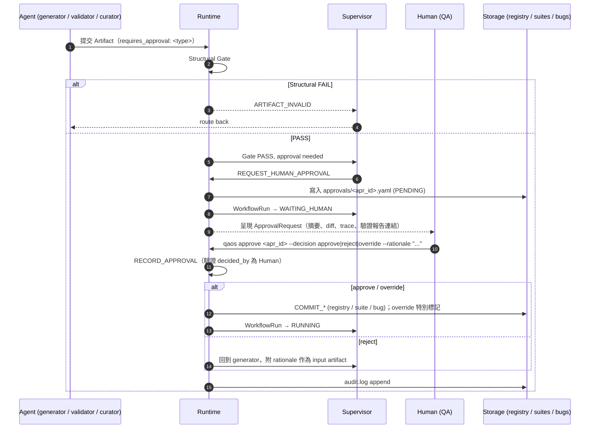

# 09 — Human Approval Flow

## 需要 Human 決定的事項（Brief §26 + Review 新增）

| Approval Type | 觸發 | 需 Human 決定的內容 | 決定後 Runtime 動作 |
|---|---|---|---|
| `ACTIVATE_TESTCASE` | TC VALIDATED | 是否成為 Registry ACTIVE 版本（可批次） | COMMIT_TO_REGISTRY + SUPERSEDE 舊版 |
| `APPLY_CHANGE` | VersionComparisonReport 完成 | 「是否將此新版 Test Case 更新為正式 Registry 版本？」（Brief §10 原句） | 同上 + obsolete TC → RETIRED |
| `RETIRE_TESTCASE` | Change Impact 判定 obsolete / Curator 建議 | 是否退役 | status → RETIRED，Suite 中移除 |
| `OPEN_BUG` | Bug VALIDATED | 是否成為正式 Bug、最終 severity/priority | COMMIT_BUG（status OPEN） |
| `CLOSE_BUG` | Bug VERIFIED | 關閉 | status → CLOSED |
| `CHANGE_BUG_SEVERITY` | Human 或 Validator 建議與 Draft 不同 | 重大 severity / priority 變更 | 更新 + history |
| `UPDATE_SUITE_MEMBERSHIP` | RegressionProposal 通過 G-REG | 加入 / 移出 Full / CI / Hotfix / Smoke suite | UPDATE_SUITE_MEMBERSHIP（新 suite version） |
| `RESOLVE_AMBIGUITY` | Spec Analyst 標記 critical ambiguity | 接受哪個解讀作為正式需求（或退回 SPEC 作者）。Runtime 同時為每個 ambiguity 開一張 **Clarification（問 PM 的單）**；**PM 未回答（Clarification 非 ANSWERED）前 Runtime 拒絕 approve** | Clarification → APPLIED；T1 重開讓 Spec Analyst 帶答案重產；Requirement → ACTIVE 並記錄 `resolved_by_approval` |
| `HUMAN_OVERRIDE` | Validation 迭代超過上限 / Gate FAIL 但 Human 認為可接受 | 強制通過（必填 rationale） | 依 context 執行對應 commit，audit 標記 override |
| `NEEDS_DECISION` | Supervisor 無法判斷 task_type / 架構級未決事項 | 選擇 Option | 記錄於 `docs/decisions/` |

**Agent 動詞**：propose / draft / analyze / validate / compare / recommend。**Human 動詞**：approve / reject / override。

## Human Approval Flow（Mermaid #12）

## ApprovalRequest 必須呈現給 Human 的內容
1. 一句話摘要（要批准什麼）
2. 影響範圍：涉及的 TC / Bug / Suite 與版本
3. Diff（新舊版本比較，來自 VersionComparisonReport 或 Suite diff）
4. 驗證結果（TestValidationReport / BugValidationReport 摘要）
5. Traceability 鏈（`qaos trace`）
6. Agent 的建議（recommend）與理由
7. 可選項：approve / reject / override
