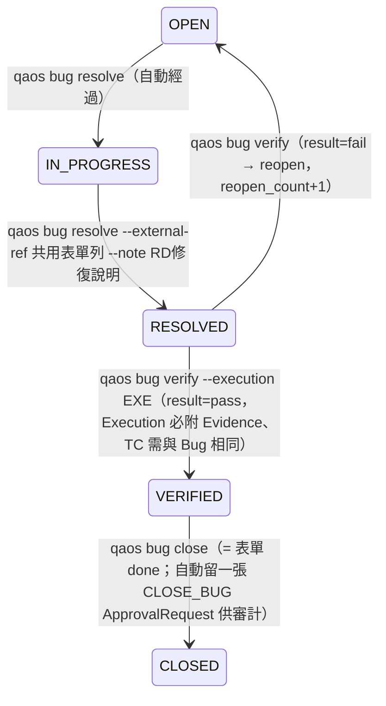

# Bug 開單後的生命週期（WF-B 之後；RD 不進 QAOS）

> 2026-09-14 依 QA 實務補上：RD 的修復回覆在開發團隊共用表單，不會操作 QAOS；QA 複測後在表單掛 done。QAOS 端由 QA 登記每一步，保留證據與審計。

| 步驟 | 誰 | 指令 | Runtime 檢查 |
|---|---|---|---|
| RD 修好，回覆在共用表單 | QA 轉錄 | `bin/qaos bug resolve BUG-x --external-ref "<表單列/連結>" --note "<RD 說明>" --fixed-by RD名 --by you` | 狀態必須 OPEN / IN_PROGRESS |
| QA 複測 | QA | 先 `evidence add`（截圖 / API 回應）→ `execution import --testcase-id <Bug 的 TC> --result pass\|fail --evidence EVD-x` → `bin/qaos bug verify BUG-x --execution EXE-x --by you` | Execution 必須有 Evidence（hash 驗證）；TC 必須與 Bug 的 `testcase_id` 一致；pass → VERIFIED，fail → OPEN |
| 結案 | QA | `bin/qaos bug close BUG-x --by you` | 只有 VERIFIED 可結案；自動建 `CLOSE_BUG` approval（decided_by = 你） |

- 所有步驟寫入 Bug 的 `history[]`；`external_ref` 是 QAOS 與共用表單的對照鍵。
- 複測用的 TC 就是 Bug 追溯到的那條（例如 BUG 場次數缺欄位 → `TC-DAILYREPORT-029`），複測結果同時成為該 TC 的 Execution 紀錄，Regression Curator 之後可據此評估 stability。
- Phase 5 若接 Jira / 共用表單 API，`resolve` 可改為自動同步；現階段刻意保持人工登記，因為「RD 說修好了」不等於「QA 驗過了」。
