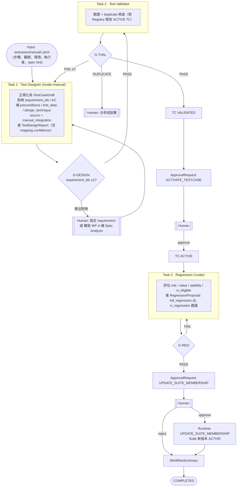

# WF-D — Manual Test → Regression（Mermaid #6）

| 項目 | 定義 |
|---|---|
| Input | `testcases/manual/<record_id>.yaml`（Human 寫入；schema：`manual-test-record`） |
| Initial State | 記錄存在；TC 不存在 |
| Agents | Test Designer(mode=manual)、Test Validator、Regression Curator |
| Artifacts | TestCaseDraft、TestDesignReport、TestValidationReport、RegressionProposal、ApprovalRequest ×2、WorkflowSummary |
| Gates | G-DESIGN → G-TVAL → G-APPROVAL → G-REG → G-APPROVAL |
| Failure Handling | 無法對映 requirement → 停止並詢問 Human（不得假設） |
| Human Approval | ACTIVATE_TESTCASE、UPDATE_SUITE_MEMBERSHIP（**兩段分開**：進 Registry ≠ 進 Regression） |
| Output | TC ACTIVE + Full Regression membership（+ CI 建議） |
| Final State | COMPLETED |
