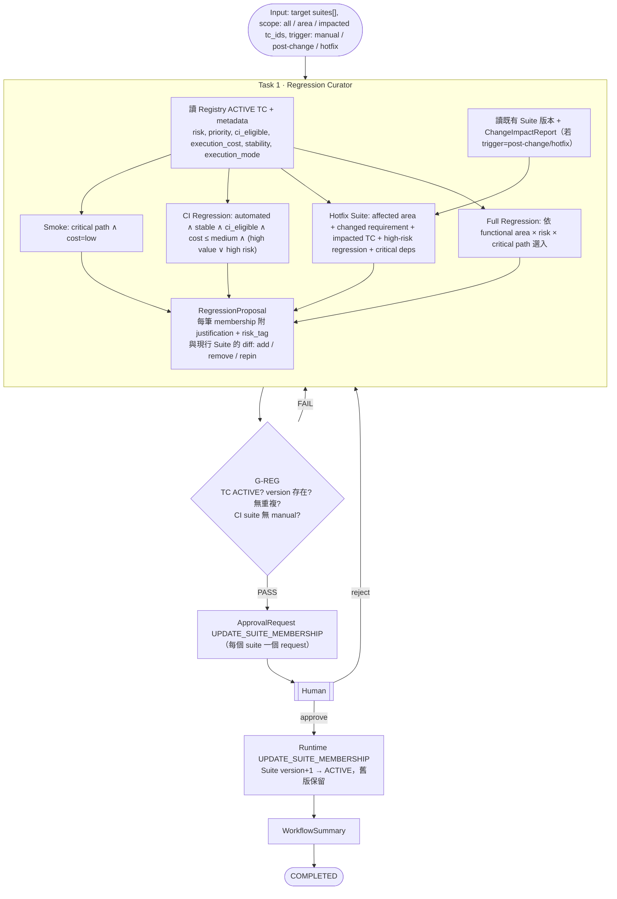

# WF-E — Regression Generation（Mermaid #7）

| 項目 | 定義 |
|---|---|
| Input | `target_suites[]`（full_regression / ci_regression / hotfix / smoke / feature）、`scope`、`trigger`、hotfix 時附 `change_impact_id` |
| Initial State | Registry 有 ACTIVE TC |
| Agents | Regression Curator |
| Artifacts | RegressionProposal、ApprovalRequest、WorkflowSummary |
| Gates | G-REG → G-APPROVAL |
| Failure Handling | 任一 membership 引用非 ACTIVE TC → Structural FAIL |
| Human Approval | UPDATE_SUITE_MEMBERSHIP（**加入與移出都要**，Brief §26） |
| Output | Suite 新版本；`suites-of` 反查即為 TC 的 derived regression/ci status |
| Final State | COMPLETED |
