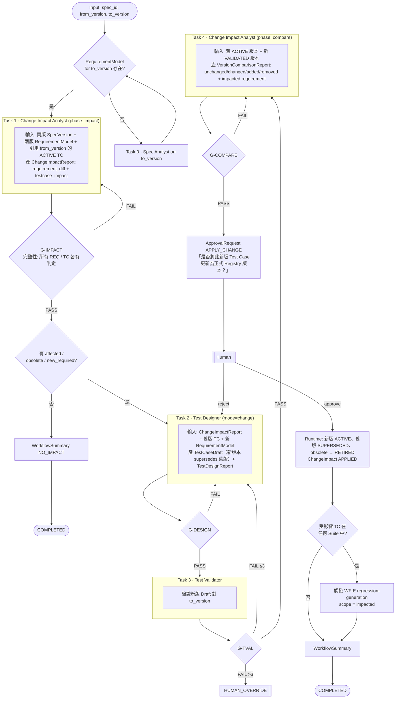

# WF-C — SPEC Change Impact（Mermaid #5）

| 項目 | 定義 |
|---|---|
| Input | `spec_id`, `from_version`, `to_version`（to_version 已由 Human 匯入 `specs/`） |
| Initial State | ChangeImpact DETECTED |
| Agents | Change Impact Analyst（兩階段）、Test Designer、Test Validator、(Spec Analyst) |
| Artifacts | ChangeImpactReport、TestCaseDraft、TestDesignReport、TestValidationReport、VersionComparisonReport、ApprovalRequest、WorkflowSummary |
| Gates | G-IMPACT → G-DESIGN → G-TVAL → G-COMPARE → G-APPROVAL |
| Transitions | ChangeImpact：DETECTED → ANALYZING → IMPACTED → TEST_UPDATE_REQUIRED → VALIDATING → COMPARING → PENDING_APPROVAL → APPLIED |
| Failure Handling | 同 WF-A；「不能直接覆蓋既有正式 TC」由 Runtime 保證（Agent 無 COMMIT 權限） |
| Human Approval | APPLY_CHANGE（必要，Brief §10 原句）、RETIRE_TESTCASE（obsolete 時併入同一 request） |
| Output | 新 TC 版本 ACTIVE、舊版 SUPERSEDED、VersionComparisonReport |
| Final State | APPLIED / NO_IMPACT |
