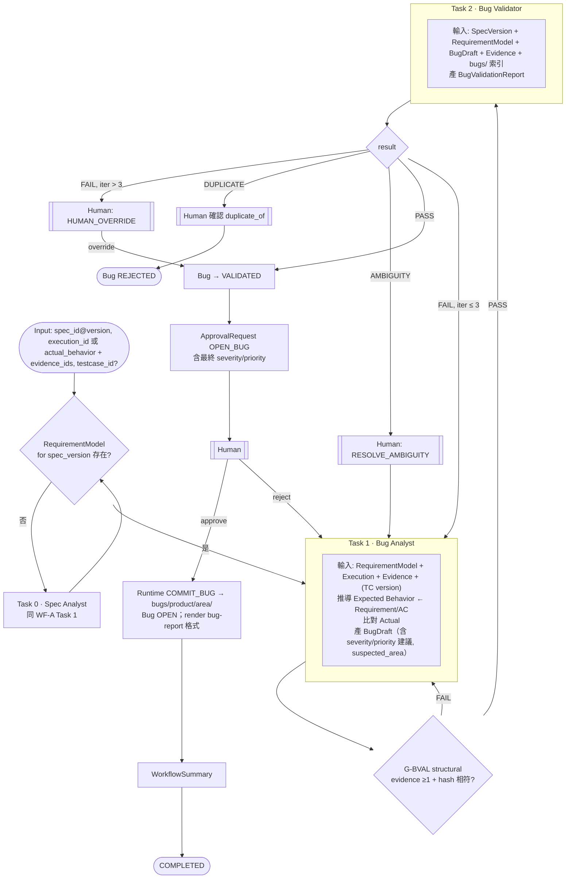

# WF-B — SPEC → Bug（Mermaid #4）

| 項目 | 定義 |
|---|---|
| Input | `spec_id@spec_version`；`execution_id`（或 `actual_behavior` 文字 + `evidence_ids[]`）；可選 `testcase_id@version` |
| Initial State | Evidence 已由 Human/CI 存入 `evidence/`（帶 sha256） |
| Agents | (Spec Analyst 若無 RequirementModel)、Bug Analyst、Bug Validator |
| Artifacts | BugDraft、BugValidationReport、ApprovalRequest、WorkflowSummary |
| Gates | G-BVAL、G-APPROVAL |
| Failure Handling | 無 Evidence → Structural FAIL，Run 不得繼續（No Evidence, No Formal Bug）；DUPLICATE / AMBIGUITY 是 Validator 的特殊 FAIL 子型 |
| Human Approval | OPEN_BUG（必要）、確認 duplicate、RESOLVE_AMBIGUITY、HUMAN_OVERRIDE |
| Output | `bugs/<product>/<area>/<bug_id>.yaml`（OPEN）+ human-facing render（md/html） |
| Final State | COMPLETED / REJECTED / FAILED |
