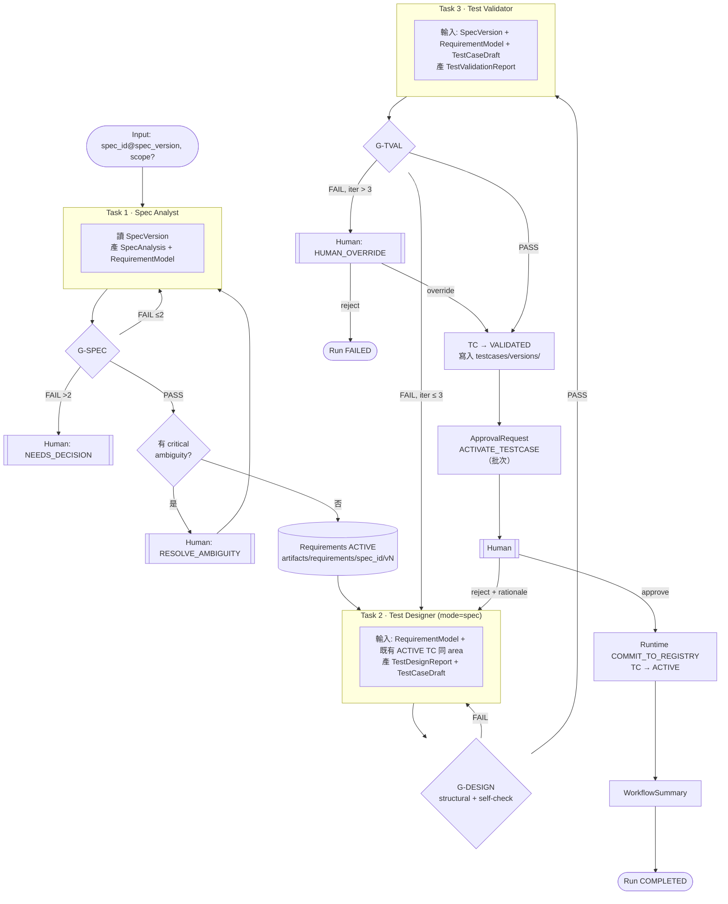

# WF-A — SPEC → Test Case（Mermaid #3）

| 項目 | 定義 |
|---|---|
| Input | `spec_id`, `spec_version`, 可選 `scope`（functional area / requirement 子集） |
| Initial State | WorkflowRun CREATED；TC 不存在 |
| Agents | Spec Analyst、Test Designer、Test Validator（Supervisor 編排） |
| Artifacts | SpecAnalysis、RequirementModel、TestDesignReport、TestCaseDraft、TestValidationReport、ApprovalRequest、WorkflowSummary |
| Gates | G-SPEC → G-DESIGN → G-TVAL → G-APPROVAL |
| Transitions | 見 Mermaid；TC：DRAFT → VALIDATING → VALIDATED → PENDING_APPROVAL → APPROVED → ACTIVE |
| Failure Handling | Structural FAIL 不計迭代；G-TVAL FAIL 最多 3 次後升級 Human Override |
| Human Approval | RESOLVE_AMBIGUITY（條件）、HUMAN_OVERRIDE（條件）、ACTIVATE_TESTCASE（必要） |
| Output | Registry ACTIVE TC 列表、WorkflowSummary |
| Final State | Run COMPLETED / FAILED / CANCELLED |
